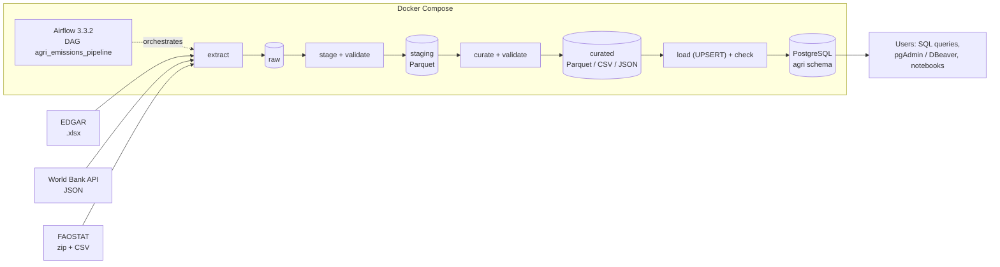

## AGRICULTURAL GHG EMISSIONS PIPELINE (GROUP DELTA)

**A Combination of three sources, primarly from EDGAR (Main), World Bank (For population), and FAOSTAT (EXTRA REFERENCE)**

``By the time we finish, our pipeline should be able to utilize all three sources for their respective purposes, and perform necessary cleaning and validation in the stated layers of the project (raw - staging - curated). They should also be able to load into postgreSQL , with airflow running and docker compose handling the packaging. 


```Finished```

## Members of Group Delta 
**1. Abad, Rolando Alfonso - (Docker, Airflow, extraction, transformations, validation, load, docs, Ppt)**

**2. Tolentino Feny Lane - (FAOSTAT extraction, warehouse schema, ERD, extraction tests, Powerpoint)** 

**3. Perez, Bienn Jaime - (data flow diagram and presentation)**


## SOURCES USED:
- EDGAR 2026 GHG booklet (Excel): https://edgar.jrc.ec.europa.eu/report_2026
- World Bank World Development Indicators API, population (`SP.POP.TOTL`, JSON): https://api.worldbank.org/v2/  ``(Made possible by datahelpdesk.worldbank.org/knowledgebase/articles/898581-api-basic-call-structures)``
- FAOSTAT Emissions Totals, bulk download (zip with a CSV): https://www.fao.org/faostat/en/#data/GT

# Agricultural GHG Emissions Pipeline (EDGAR + World Bank + FAOSTAT)

**DSS150P Data Engineering, Group Delta.** An automated, reproducible pipeline that downloads agricultural
greenhouse-gas emissions (EDGAR and FAOSTAT) and population (World Bank), cleans and validates them in layers
(raw -> staging -> curated), and loads analysis-ready tables into PostgreSQL. Apache Airflow runs it and
Docker Compose packages it.


## 1. Problem statement

Agriculture produces about 6.3 billion tonnes of CO2-equivalent a year, mostly methane from livestock
and rice and nitrous oxide from soils and fertiliser. Analysts who compare countries (for example, the
Philippines against its ASEAN neighbours) need figures that are **recent (up to 2025)**, **comparable
between countries** (per person, not just totals), **clearly labelled** where the numbers are still
estimates, and **broken down by activity** (livestock, rice, fertiliser, manure), because that is where
policy can act.

No single source gives all of this. EDGAR has recent totals but treats agriculture as one sector; FAOSTAT
splits agriculture into activities but ends two years earlier; the World Bank has the population. The three
publishers update on different schedules (EDGAR and FAOSTAT once a year, the World Bank several times a year),
so this needs a **pipeline** that re-downloads, re-checks and reloads the data on a schedule, not a one-time analysis.

**Who uses the data, and for what:**

| Users | What they look up in our tables | Decision it supports |
|---|---|---|
| Climate and agriculture policy analysts (for example at the Philippine Department of Agriculture or the Climate Change Commission) | Which farm activities drive the country's emissions, and how it compares with ASEAN neighbours per person | Where to target methane and nitrous-oxide reduction (rice water management, livestock, fertiliser use) |
| Researchers, NGOs and journalists | Country totals and per-person values over time, with recent estimates clearly marked | Which countries and trends to study or report on |
| Data analysts and students | Clean, joined tables in PostgreSQL instead of three differently shaped downloads | Repeatable analysis with SQL, BI tools or notebooks |

## 2. Objectives and key questions

1. Which countries emit the most agricultural greenhouse gases, and how has this changed from 1970 to 2025?
2. How much of each country's agricultural emissions is methane, nitrous oxide or CO2?
3. Which countries have the highest agricultural emissions **per person**?
4. How does the Philippines compare with other ASEAN countries?
5. Which **farm activities** drive the emissions (livestock digestion, rice, fertiliser, manure), and how
   closely do the two emission sources, EDGAR and FAOSTAT, agree?

**Data products** (files + PostgreSQL tables, see [data dictionary](docs/data_dictionary.md) and
[data contracts](docs/data_contract.md)):

- `agri_country_year` (main product): one row per country and year with gas totals, share of the world,
  yearly change, population and tonnes per person (EDGAR + World Bank).
- `agri_emissions_by_activity`: one row per country, farm activity and year (FAOSTAT, 2000-2023).
- `edgar_vs_faostat`: both sources' agriculture totals side by side, with the difference.

## 3. Scope

- **In scope:** EDGAR sector `Agriculture` (CO2, CH4, N2O), 1970-2025, about 205 countries; World Bank population;
  FAOSTAT's 8 farm activities (FAO Tier 1 estimates, CO2eq with AR5 factors), 2000-2023.
- **Out of scope:** other EDGAR sectors and the rest of the FAOSTAT file (energy, land use, food processing, ...);
  they are kept in staging but not curated. Land use / forestry (LULUCF).

## 4. Data sources

| Source | Provider | Type / format | Retrieval | License |
|---|---|---|---|---|
| EDGAR 2026 GHG booklet | European Commission, JRC | File download, Excel (.xlsx) | Scripted HTTP download | CC BY 4.0 |
| World Development Indicators, `SP.POP.TOTL` | World Bank | REST API, JSON (paged) | Scripted API calls | CC BY 4.0 |
| FAOSTAT Emissions Totals (domain GT) | FAO | Bulk file download, zip with a CSV (2.5 million rows) | Scripted HTTP download | CC BY 4.0 |

Full details (links, update frequency, volume, limitations): [docs/source_inventory.md](docs/source_inventory.md).
Profiling reports: [EDGAR](docs/profiling/edgar_profile.md), [World Bank](docs/profiling/worldbank_profile.md),
[FAOSTAT](docs/profiling/faostat_profile.md).

## 5. Architecture and tech stack



Python 3.12 (pandas, pyarrow, requests, openpyxl) · PostgreSQL 16 · Apache Airflow 3.3.2 (LocalExecutor) ·
Docker Compose · Git/GitHub
Detailed diagram and tool choices: [docs/architecture.md](docs/architecture.md) ·
lineage: [docs/data_flow.md](docs/data_flow.md) · database: [docs/erd.md](docs/erd.md).

## 6. Repository structure

```
agri-ghg-pipeline/
├── README.md
├── requirements.txt            # Python packages (pinned to Airflow 3.3.2 constraints)
├── Dockerfile                  # official Airflow image + our packages
├── docker-compose.yml          # Airflow + 2 PostgreSQL databases
├── .env.example                # all settings; copy to .env
├── config/
│   ├── pipeline.yaml           # links, years, thresholds (no secrets)
│   ├── country_mapping.csv     # EDGAR merged countries -> ISO3 / World Bank codes
│   └── faostat_area_mapping.csv  # FAOSTAT areas without an ISO code -> EDGAR codes
├── dags/agri_emissions_pipeline.py
├── src/
│   ├── config.py
│   ├── extract/                # http.py, edgar.py, worldbank.py, faostat.py
│   ├── transform/              # edgar.py, worldbank.py, faostat.py, curated.py, curated_faostat.py
│   ├── validation/             # checks.py (reusable), rules.py (per dataset)
│   ├── load/                   # db.py (PostgreSQL helpers), warehouse.py
│   └── utils/                  # logger, errors, files, file_formats
├── sql/                        # 01_schema.sql (DDL), 02_queries.sql
├── scripts/                    # run_pipeline.py, profile_sources.py, read_partition_demo.py
├── tests/                      # pytest unit tests
├── docs/                       # diagrams, dictionary, contracts, sources, profiling
├── data/raw | staging | curated   (created by the pipeline, not committed)
└── outputs/                    # validation and comparison reports (not committed)
```

## 7. Setup

**Prerequisites:** Git, Docker Desktop (give Docker at least **4 GB of memory**, 2 CPUs, 10 GB disk), internet.

```bash
git clone https://github.com/racabad27/agri-ghg-pipeline.git
cd agri-ghg-pipeline
cp .env.example .env          # Windows PowerShell: Copy-Item .env.example .env
```

Open `.env` and change the passwords. Use only letters and numbers in the passwords: they become part of database connection links, where symbols such
as `@ : / #` break them. Make `.env` **before** the first `docker compose up`; if you change a password after
the first start, reset the databases with `docker compose down -v`.

| Variable | Meaning | Default |
|---|---|---|
| `AIRFLOW_UID` | user the Airflow containers run as | 50000 |
| `AIRFLOW_ADMIN_USER` / `AIRFLOW_ADMIN_PASSWORD` | login for http://localhost:8080 | airflow / (set yours) |
| `AIRFLOW_DB_USER` / `_PASSWORD` / `_NAME` | Airflow's own metadata database | airflow |
| `AIRFLOW_JWT_SECRET` | secret Airflow uses to sign internal tokens | (set a long random text) |
| `FERNET_KEY` | optional encryption key for saved connections | empty |
| `WAREHOUSE_DB_HOST` / `_PORT` | warehouse address **from your laptop** (Docker uses `warehouse-db:5432`) | localhost / 5433 |
| `WAREHOUSE_DB_NAME` / `_USER` / `_PASSWORD` | our PostgreSQL warehouse | agri_dw / agri |

Non-secret settings (source links, EDGAR edition, FAOSTAT scope, thresholds) are in
[`config/pipeline.yaml`](config/pipeline.yaml).

### Start the Docker services

```bash
docker compose up -d --build     # first time: builds our Airflow image (a few minutes)
docker compose ps -a             # wait until all services say (healthy); airflow-init says Exited (0)
```

**PostgreSQL** is set up automatically: `airflow-init` prepares Airflow's database, and our warehouse tables
are created by `sql/01_schema.sql` at the start of every load (`CREATE ... IF NOT EXISTS`, safe to repeat).
To create them by hand: `docker compose exec airflow-scheduler python -m src.load.db`.

Stop: `docker compose down` · full reset including databases: `docker compose down -v`.

## 8. Run the pipeline

**Airflow UI (recommended):** open http://localhost:8080, log in, find `agri_emissions_pipeline`
and switch it **on**. Because the DAG is scheduled monthly, Airflow starts this month's run right away.
Later runs: press **Trigger**; the form that opens lets you change `edgar_edition` or `force_download` first.
The first run downloads about 25 MB and takes a few minutes; later runs on the same day reuse the downloads.

**Command line:**

```bash
docker compose exec airflow-scheduler airflow dags unpause agri_emissions_pipeline
docker compose exec airflow-scheduler airflow dags trigger agri_emissions_pipeline
docker compose exec airflow-scheduler airflow dags list-runs agri_emissions_pipeline
```

**Without Airflow (debugging):** `docker compose exec airflow-scheduler python scripts/run_pipeline.py`
(or one step: `--step extract|stage|validate_staging|curate|validate_curated|load|check_warehouse|formats`).

**Inspect a run in Airflow:** open the DAG, **Graph** shows the task order and colours (green = success,
red = failed, yellow = retrying); click a task, then **Logs**, to see every step with row counts and check results.
Log files are also in `logs/`.

**What happens when a task fails:**

- Downloads and database steps are tried **3 times** (1 minute apart), because network and connection
  problems are often temporary. A failed **data-quality check** fails at once, without retries: the same data
  would fail again.
- Every task is stopped after **30 minutes**, so a hanging download cannot block the run.
- When a task has failed for good, its log ends with a line `PIPELINE FAILED at task <task> (run <run id>) ...`
  giving the reason, and the tasks after it are marked `upstream_failed` and do not run. So if any check before
  the load fails, nothing new reaches the database. The load itself is one transaction: if it fails halfway,
  PostgreSQL keeps the previous data. Because all curated tables are loaded together, a failure in any one source
  (for example FAOSTAT) also stops the EDGAR and World Bank tables from being refreshed that month; we chose this
  so the tables in the database always come from the same run.

**Profile the raw sources** (writes the reports in `docs/profiling/`):
`docker compose exec airflow-scheduler python scripts/profile_sources.py`.

## 9. Outputs and where to find them

| Output | Location |
|---|---|
| Raw downloads + metadata (link, time, method; size and SHA-256 of the EDGAR and FAOSTAT files; page and record counts for the World Bank) | `data/raw/edgar/edition=2026/`, `data/raw/worldbank/SP.POP.TOTL/pulled=<date>/`, `data/raw/faostat/pulled=<date>/` |
| Profiling reports (with the access date of each source) | [docs/profiling/](docs/profiling/) |
| Staging tables (Parquet) | `data/staging/edgar/sector_key=*/`, `data/staging/worldbank/population.parquet`, `data/staging/faostat/emissions_totals.parquet` |
| Curated tables (Parquet) | `data/curated/*.parquet` |
| CSV / JSON / Parquet exports | `data/curated/exports/` |
| Validation reports | `outputs/validation/*.json` |
| Rows left out, with the reason | `outputs/reports/faostat_unmatched_areas.csv`, `outputs/reports/faostat_rejected_rows.csv` |
| Format comparison | `outputs/reports/format_comparison.md` (results copied to [docs/format_comparison.md](docs/format_comparison.md)) |
| Warehouse tables | PostgreSQL `agri_dw`, schema `agri` |

Query the warehouse:

```bash
docker compose exec warehouse-db psql -U agri -d agri_dw -f 02_queries.sql
```

## 10. Data quality and validation

A validation task runs after every layer and writes a JSON report to `outputs/validation/` (the latest run).
If a check fails, the task turns red at once, the tasks after it do not run, and nothing new reaches the
database. After the load, `check_warehouse` compares the database with the files and turns red if they differ.

| Layer | Checks |
|---|---|
| EDGAR staging (9) | required columns, no nulls in keys, unique (country, sector, gas, year), accepted sectors, accepted gases, no negative values, year range 1970-2025, row count >= 250,000, **GLOBAL TOTAL = sum of countries** |
| World Bank staging (7) | required columns, no nulls, unique (country, year), population > 0, year range, row count >= 15,000, World = sum of countries (warning) |
| FAOSTAT staging (10) | required columns, no nulls, unique (area, item, element, source, year), unit is kt, row count >= 2,000,000, future years are only projections, no negative activity values (warning), **World = sum of countries**, **China = its 4 parts**, **8 activities = FAOSTAT's own subtotals** |
| Curated (9) | unique keys (2), no nulls, accepted gases, every country in `dim_country`, no negative totals, 0 <= t per person <= 100, population coverage >= 99% of emissions, shares add up to 100% |
| Curated FAOSTAT (8) | unique keys (2), no nulls, 8 known activities, no negative values, every country in `dim_country`, >= 99.5% of FAOSTAT emissions matched to a country, **EDGAR and FAOSTAT world totals within 15%** |
| Warehouse (7) | database rows = file rows (5 tables), world total in database = file, no orphan rows |

Check types used: schema, nullability, uniqueness, accepted values, ranges, row counts, business rules,
referential integrity, coverage, cross-source agreement. The download steps also reject broken files (zip
test + expected sheet or data file). Rows that cannot be used are never dropped silently: FAOSTAT areas without
an EDGAR code and impossible values (negative emissions) are written to `outputs/reports/` with the reason.

## 11. Rerun safety (idempotency)

Running the pipeline twice gives the same result, never duplicates:

- **Raw:** a download is skipped if a good copy exists (`force_download` downloads again). World Bank and
  FAOSTAT copies are kept per date (`pulled=<date>`), so every monthly run keeps a snapshot.
- **Staging / curated:** each run replaces its folder instead of adding files next to old ones.
- **PostgreSQL:** `INSERT ... ON CONFLICT (primary key) DO UPDATE` (UPSERT), then rows from older batches
  that are no longer in the files are deleted, all in **one transaction** (all or nothing).
  Every load is recorded in `agri.load_audit`.

To demonstrate this, trigger the DAG twice. The row counts stay the same and `load_audit` shows two batches:

```bash
docker compose exec warehouse-db psql -U agri -d agri_dw -c "SELECT COUNT(*) FROM agri.fact_emissions_by_activity;"
docker compose exec warehouse-db psql -U agri -d agri_dw -c "SELECT batch_id, table_name, rows_upserted FROM agri.load_audit ORDER BY audit_id;"
```

## 12. Partitioning and file formats

- **Partitioning:** EDGAR staging data is saved as Parquet **partitioned by sector** (8 folders). Staging
  keeps all 8 sectors so it stays faithful to the source, but the curated step needs only agriculture: it reads
  `sector_key=agriculture` and never opens the other 7 folders (about 11% of the rows). Sector is the right key
  because it is the filter every curated step uses; partitioning by year would create 56 small folders and still
  force a full scan. FAOSTAT staging is a single 12 MB Parquet file. The curated step reads only the 10 columns it
  needs and filters the rows while reading, but the file is still scanned from start to end, because every part of
  it mixes all 9 elements. We kept one file because it is small and takes seconds to read; partitioning it by
  `element` would skip about 80% of it (see future improvements).
  Demo: `docker compose exec airflow-scheduler python scripts/read_partition_demo.py`.
- **Formats:** sources arrive as Excel (EDGAR), JSON (World Bank) and a zipped CSV (FAOSTAT) and are kept that
  way in raw. From staging onward we use **Parquet** because it keeps column types, is compressed and supports
  partitions and filters: FAOSTAT's is about 364.0 MB CSV becomes a 12 MB Parquet file. The `compare_formats` task writes
  the main table as CSV, JSON and Parquet and compares size, write/read time and type preservation
  ([results](docs/format_comparison.md)).

## 13. Tests

```bash
docker compose exec airflow-scheduler pytest -q
```

Unit tests cover the cut-off-file checks (Excel and zip), World Bank paging and error responses, the EDGAR
reshape, both FAOSTAT layouts, country codes and flags, matching FAOSTAT areas to EDGAR countries, rejected rows,
population matching for merged countries, the curated calculations and every check function.

## 14. Limitations and assumptions

- EDGAR 2023-2025 values are **fast-track estimates** (`is_estimate = true`) and will be revised.
- **FAOSTAT ends in 2023** (release of 28 October 2025), so the activity breakdown and the comparison stop there.
- **EDGAR and FAOSTAT use different methods.** Their world totals differ by about 4-6% and some countries by much
  more, so we compare them (`edgar_vs_faostat`) and never add them together. EDGAR stays the main source for totals.
- Some EDGAR codes **merge countries** (`SDN` = Sudan + South Sudan, `ISR` = Israel + Palestine, ...). We add up
  their World Bank populations (a year is kept only when every part has data) and their FAOSTAT emissions.
- FAOSTAT areas EDGAR does not list (small Pacific islands) and 7 impossible negative values are left out and
  reported in `outputs/reports/`.
- No population for places the World Bank does not list separately (e.g. Taiwan, Réunion), so their
  per-person values are empty. France's World Bank population includes its overseas departments, which
  EDGAR lists separately, so France's per-person value is slightly low.
- Emissions use **GWP-100 from IPCC AR5** in both EDGAR and FAOSTAT, not the newer AR6 values.
- The EDGAR link contains the edition year; a new edition means updating `edgar.edition` in `config/pipeline.yaml`.

## 15. Troubleshooting

| Problem | Fix |
|---|---|
| `port is already allocated` (8080 or 5433) | Stop the other program, or change `WAREHOUSE_DB_PORT` in `.env` (e.g. 5434), then `docker compose up -d` |
| Containers keep restarting / `airflow-init` fails | Give Docker at least 4 GB of memory; read `docker compose logs airflow-init` |
| `airflow-init` fails, or logins and database connections fail after editing `.env` | Use only letters and numbers in the passwords. If you changed a password after the first start, the databases still have the old one: `docker compose down -v` (deletes both databases), then `docker compose up -d` and run the pipeline again |
| A task is killed (`SIGKILL`, exit code -9) | Docker ran out of memory; give it more (Settings -> Resources) and trigger again |
| Linux: `Permission denied` writing to `data/` or `docs/` | Set `AIRFLOW_UID` in `.env` to the output of `id -u`, then `docker compose down && docker compose up -d` |
| DAG not visible in the UI | Wait 30 seconds; run `docker compose exec airflow-scheduler airflow dags list-import-errors` |
| `extract_edgar` fails with HTTP 403/404 | Check `edgar.edition` / `url_template` in `config/pipeline.yaml` and open the link in a browser. The task logs show the exact error |
| `extract_faostat` fails (timeout, 403/404) | The task retries twice. If it still fails, open the link from `faostat.url` in a browser and save the zip, without renaming it, into the folder the task log names (`Saving today's FAOSTAT copy to .../pulled=YYYY-MM-DD/...`; the date is in UTC). Trigger again: the pipeline checks the file and records it as placed by hand |
| World Bank API errors or timeouts | The task retries automatically; if the API is down, trigger again later |
| Starting completely fresh | `docker compose down -v`, then delete the contents of `data/raw`, `data/staging`, `data/curated` (keep `.gitkeep`) |

## 16. Future improvements

- Add FAOSTAT's activity data (animal numbers, rice area, fertiliser use) to explain changes in emissions.
- Send any form of notification when a task fails (today the failure is logged and shown in the Airflow UI).

## 17. Acknowledgements

- Data (all CC BY 4.0):
  - EDGAR (Emissions Database for Global Atmospheric Research) Community GHG Database, a collaboration between
    the European Commission, Joint Research Centre (JRC), the International Energy Agency (IEA), and comprising
    IEA-EDGAR CO2, EDGAR CH4, EDGAR N2O, EDGAR F-GASES version EDGAR_2026_GHG (2026),
    https://edgar.jrc.ec.europa.eu/report_2026; report: Crippa, M. et al., *GHG emissions of all world
    countries - 2026 Report*, Publications Office of the European Union, 2026, doi:10.2760/7717504.
  - The World Bank, World Development Indicators: Population, total (SP.POP.TOTL), https://data.worldbank.org/indicator/SP.POP.TOTL.
  - FAO (2025), FAOSTAT: Emissions Totals, https://www.fao.org/faostat/en/#data/GT (access date: see
    [docs/profiling/faostat_profile.md](docs/profiling/faostat_profile.md)).
- `docker-compose.yml` is based on the official Apache Airflow 3.3.2 Docker Compose file.
- Libraries: pandas, pyarrow, openpyxl, requests, PyYAML, psycopg2, pycountry, tabulate, pytest.
- **Use of AI:** Regarding AI use, We initially had Claude (Anthropic) provide us baselines and drafts of the codes that were all used to formulate the current pipeline. Additionally, we also consulted it for possible revisions, when deemed necessary to avoid long run times and maximize efficiency in running the project. Error-checking and handling was also tested and edited by Claude to assess whether it catches the intended instance. Moreover, Claude was able to provide us a foundation that we slowly built upon as the project came to a finalization. Lastly, Claude was used extensively throughout this project to validate if what we did was even possible or makes sense from a data engineering perspective, with respect to our current scope and goals.
