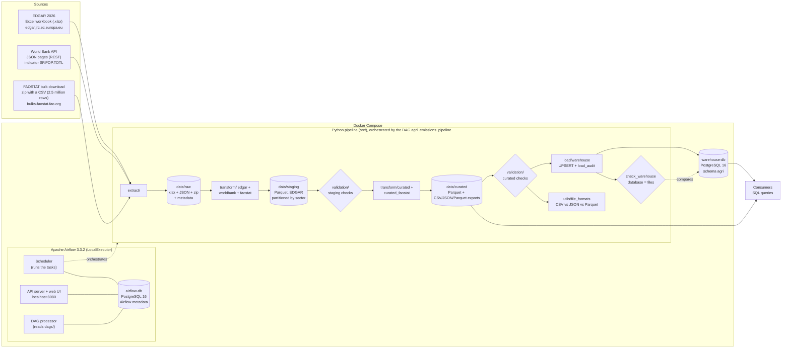

# Architecture

## Components and why we chose them

| Component | Role in our pipeline | Why this tool |
|---|---|---|
| **Python 3.12** (pandas, pyarrow, requests, openpyxl) | All extract, transform, validation and load code in `src/` | Standard for data work; reads Excel, JSON, CSV (also inside a zip) and Parquet natively |
| **Raw layer** `data/raw` | The data as the sources sent it (the EDGAR Excel file and the FAOSTAT zip byte-for-byte, the World Bank JSON pages unchanged apart from indentation), plus metadata: link, time and retrieval method, the SHA-256 of both files, page and record counts of the API pull | Keeps data traceable to its origin; we can always re-run from here |
| **Staging layer** `data/staging` | Cleaned, typed, long-format tables in Parquet; EDGAR partitioned by sector | Parquet keeps column types and is small (FAOSTAT: 325 MB of CSV -> 12 MB); partitions let us read only agriculture |
| **Curated layer** `data/curated` | Agriculture-only, analysis-ready tables: country-year totals (EDGAR + World Bank), emissions by activity (FAOSTAT), EDGAR vs FAOSTAT | This is the data product people use |
| **Validation** `src/validation` | 10 kinds of checks after every layer (50 checks in total); a failure turns the Airflow task red | Bad data stops the pipeline instead of reaching the database |
| **PostgreSQL 16** `warehouse-db` | Stores the curated tables with keys and constraints | Primary keys, foreign keys and CHECK constraints reject duplicates, orphan rows and impossible values even if our code has a bug; `INSERT ... ON CONFLICT` makes reruns safe; standard tools (pgAdmin, DBeaver, BI tools) connect to it. *Alternatives:* SQLite or DuckDB are single files with no server that several users and tools can share; a cloud warehouse would cost money for this data size |
| **Apache Airflow 3.3.2** | Runs the tasks in order, with retries, schedule (monthly) and logs | Knows the dependencies between tasks, retries failed ones, runs on a schedule and keeps every run's logs in a UI where a failure can be found quickly. *Alternatives:* cron can only start a script at a time, with no dependencies, retries or run history; one Python script (`scripts/run_pipeline.py`, which we keep for debugging) runs everything in order but has no scheduling or UI |
| **Docker Compose** | Starts Airflow, both databases and our code the same way on every laptop | One command starts the same versions on Windows, Mac and Linux; nothing to install but Docker. *Alternative:* installing Python, PostgreSQL and Airflow by hand on each laptop (Airflow does not run on Windows) |

## Design decisions and trade-offs

- **LocalExecutor instead of CeleryExecutor**: one machine and a small pipeline, so we do not need Redis
  and worker containers. Fewer containers means less memory on our laptops.
- **Two PostgreSQL databases**: Airflow's metadata is kept apart from our warehouse, so resetting one
  never touches the other.
- **Files between layers, database at the end**: each layer is a folder we can open and check,
  and the database only receives data that passed validation.
- **Monthly schedule**: the World Bank updates several times a year, EDGAR and FAOSTAT once a year. A monthly
  run picks up changes; EDGAR is skipped when the edition is already there, and the World Bank and FAOSTAT
  copies are dated, so every monthly run keeps a new snapshot.
- **Three independent branches**: EDGAR, World Bank and FAOSTAT are extracted, staged and checked in parallel.
  A failure in one branch stops everything after it, but the other branches still finish, so the logs show
  exactly which source failed.
- **EDGAR stays the main emissions source**, FAOSTAT adds what EDGAR does not have (the split by activity,
  up to 2023) and a second opinion on the totals. The two are never added together, because they measure
  the same emissions with different methods.
