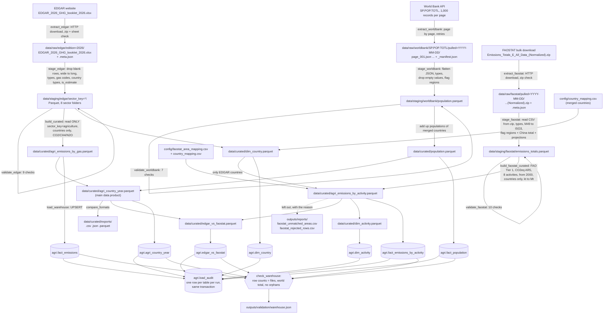

# Data flow and lineage



## What each layer is allowed to do

| Layer | Allowed | Not allowed |
|---|---|---|
| Raw | Save the file exactly as received; add a metadata file next to it | Editing, renaming columns, deleting rows |
| Staging | Drop empty rows, reshape wide to long, fix types, trim text, map codes, add flags | Filtering the scope (all sectors and all countries stay), joining other sources |
| Curated | Filter to agriculture and real countries, join population, compute totals, shares, growth, per-person; match FAOSTAT areas to EDGAR countries, convert kt to Mt, set aside impossible rows (with a report) | Changing source values |
| Warehouse | Upsert curated rows, delete stale rows from older batches, write the audit table | Any transformation (the database mirrors the curated files) |

## Tracing one record through the pipeline (demo)

Philippines, methane from agriculture, 2024:

1. **Raw**: open `data/raw/edgar/edition=2026/EDGAR_2026_GHG_booklet_2026.xlsx`, sheet
   `GHG_by_sector_and_country`, the row `GWP_100_AR5_CH4 | Agriculture | PHL`, column `2024`.
2. **Staging**:
   ```bash
   docker compose exec airflow-scheduler python -c "import pandas as pd; df = pd.read_parquet('data/staging/edgar', filters=[('sector_key','==','agriculture')]); print(df.query(\"country_code=='PHL' and gas=='CH4' and year==2024\"))"
   ```
3. **Curated**:
   ```bash
   docker compose exec airflow-scheduler python -c "import pandas as pd; df = pd.read_parquet('data/curated/agri_emissions_by_gas.parquet'); print(df.query(\"country_code=='PHL' and gas=='CH4' and year==2024\"))"
   ```
4. **Warehouse**:
   ```bash
   docker compose exec warehouse-db psql -U agri -d agri_dw -c "SELECT * FROM agri.fact_emissions WHERE country_code='PHL' AND gas_code='CH4' AND year=2024;"
   ```

The value is the same at every step, and `batch_id` / `loaded_at` show which run wrote it.

### The same for FAOSTAT: Philippines, rice cultivation, 2023

1. **Raw**: the zip in `data/raw/faostat/pulled=<date>/`; inside the CSV, the row with area code `171`
   (Philippines), item `Rice Cultivation`, element `Emissions (CO2eq) (AR5)`, source `FAO TIER 1`, year `2023`
   (value in kt).
2. **Staging**:
   ```bash
   docker compose exec airflow-scheduler python -c "import pandas as pd; df = pd.read_parquet('data/staging/faostat/emissions_totals.parquet', filters=[('area_code','==',171),('item_code','==',5060),('year','==',2023)]); print(df)"
   ```
3. **Curated** (kt / 1,000 = Mt):
   ```bash
   docker compose exec airflow-scheduler python -c "import pandas as pd; df = pd.read_parquet('data/curated/agri_emissions_by_activity.parquet'); print(df.query(\"country_code=='PHL' and activity_code==5060 and year==2023\"))"
   ```
4. **Warehouse**:
   ```bash
   docker compose exec warehouse-db psql -U agri -d agri_dw -c "SELECT * FROM agri.fact_emissions_by_activity WHERE country_code='PHL' AND activity_code=5060 AND year=2023;"
   ```
