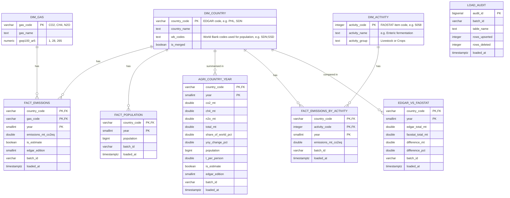

# Database schema (ERD)

Schema `agri` in the `warehouse-db` PostgreSQL database. DDL: [`sql/01_schema.sql`](../sql/01_schema.sql).

## Keys and constraints

- **Primary keys** stop duplicates: `(country_code, gas_code, year)` for EDGAR emissions,
  `(country_code, activity_code, year)` for FAOSTAT emissions, and `(country_code, year)` for population, the
  country-year table and the comparison. They are also what `ON CONFLICT` uses when we UPSERT.
- **Foreign keys** stop orphan rows: every fact row must point to a country (and gas or activity) that exists.
  All three sources share one country list, `dim_country` (EDGAR codes), so they can be joined.
- **CHECK constraints** stop impossible values: negative emissions, population of 0, and years outside each
  table's range (from 1970 for EDGAR tables, 1960 for population, 1961 for FAOSTAT tables, up to 2100).
- **Index** on `year`, because most queries filter by year.
- `load_audit` is not linked to other tables; it is a log of every load (batch, table, rows).
